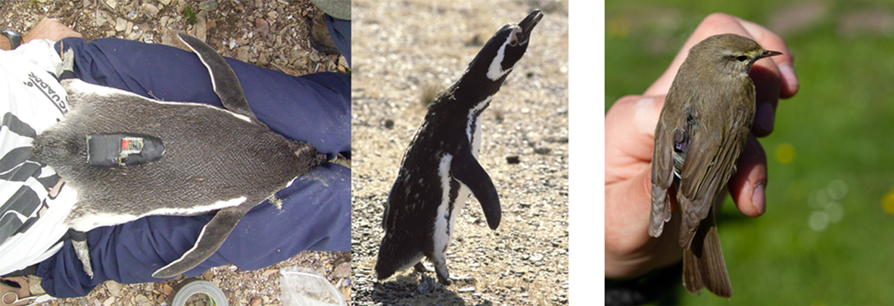
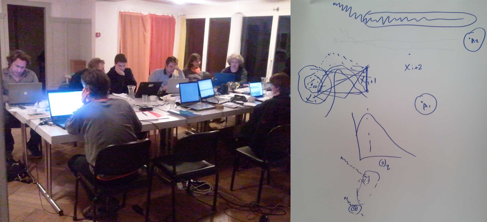

---
authors:
- admin
categories: []
date: "2019-12-11T00:00:00Z"
image:
  caption: ""
  focal_point: ""
lastMod: "2019-12-11T00:00:00Z"
projects: []
subtitle: 
summary:  
tags:
- Geolocation
- Migration
- R
title: "Light‐Level Geolocator Analyses: A user's guide"
---

Established in 1987, the ARGOS system allowed the world-wide tracking of animals equipped with satellite transmitters. This new technology provided unprecedented insights into the movements of animals. But the devices were bulky as well as heavy and not yet ready to track the majority of smaller species like birds. In search for alternatives, the biologist Rory Wilson recalled that early voyagers did not have on-board GPS, nor satellite transmitters to ascertain their position (1). Instead, they observed the sun`s trajectory to estimate their whereabouts, using the day length to derive latitude and the exact time of noon to estimate longitude. He concluded that a simple light sensor, which requires far less power than a satellite transmitter, may provide reliable information about seabird movements across the annual cycle. After designing tags that consisted of a light sensor, a clock, a memory chip, and a lithium battery, he first deployed these tags on wandering albatrosses and Magellanic penguins.

Since then, geolocation by light has come a long way and is currently one of the most frequently used tracking technologies in bird migration research. A real boost in the number of applications happened after Bridget Stutchbury and her team deployed 1.5g geolocators developed by the British Antarctic Survey on different songbird species in 2008 (2). Recently, Migrate Technology Ltd. developed a 0.32g logger that successfully recorded a 13.000km migration route of 10g Willow warblers from Far East Russia to East Africa (3).

Figure 1: One of the first light-level geolocators deployed on an animal, a Magellanic penguin, to track its movement. The tag was developed, built and deployed by Rory Wilson, despite huge amount of flack for this approach criticising that this method was only good for revealing movement on an ocean basin scale. One of the most recent developed tag weights only 0.35 g (from Migrate Technology Ltd.) and was used to track a 10 g Willow warbler (right). Image credits: Rory Wilson (left, centre), Harald Ris (right).

However, there was not only the need to build smaller and smaller tags, but to develop tools and methods that produce scientifically sound and reproducible tracks from light intensity recordings. The major downside of this technology is arguable the low accuracy compared to satellite mediated locations that results from the fact that light almost never hits the sensor of the logger without some level of shading. And even worse, the very same amount of shading has a very different effect on the accuracy depending on the time of the year and the actual location of the logger on the globe. Thus, researcher regularly struggled in the analysis and interpretation of the results.

In 2011 the Swiss Ornithological Institute organised a first international workshop, at a beautiful site in the Alps, to discuss methods and potential developments of open source tools for the analysis of geolocator data. The National Center for Ecological Analysis and Synthesis funded another meeting in 2013 taking place in Santa Barbara, California. Stimulated or improved by these meetings, various R packages and other open source tools emerged that allow users to apply different theories and use additional information to improve the accuracy and precision of location estimates based on light recordings.
In our 'HOW TO...' paper that is part of the special issue on biologging in Journal of Animal Ecology (Lisovski et al. 2020) we now provide an overview of the different tools that may help in choosing an appropriate analysis method. Furthermore, we give advice on how to interpret and report results and introduce a comprehensive online manual that applies the concepts to several datasets, demonstrates the use of open‐source analysis tools with step‐by‐step instructions and code and details our recommendations for interpreting, reporting and archiving [link](https://geolocationmanual.vogelwarte.ch/).

Figure 2: Coding jam at the 1st international workshop on how to best analyse light level geolocator data to ensure sound and reproducible results (left). Michael Sumner guide to geolocation by light (right): Photo credit: Felix Liechti.

And even though satellite tags are becoming smaller and smaller too, allowing to track small birds with high accuracy, we consider our efforts to be of value to the research community for the years to come. In addition to the relatively low costs, several recent technological advancements will perhaps even increase the appeal of light level geolocators. The most important among them is probably the combination of light recording with other en-route data, such as air pressure, acceleration, magnetism and temperature. These additional data can facilitate the refinement of location estimates. For instance, acceleration data or changes in air pressure can distinguish movement and residency periods relatively easily, and such prior knowledge can then be fed into the stationary location estimation. These additional sensor data also provide a wealth of complementary information on fine‐scale behaviour: air pressure and temperature can be used to infer flight altitude and initiation and termination of migratory or foraging flights; acceleration data can be used to determine daily activity budgets and, given supplementary measurements, be related to energy expenditure and energy budgets; magnetic field data can be used to infer strategies in orientation and navigation during migration. Combining such behavioural information with refined, reliable and accurate location estimates can assist in identifying habitat associations of migrants or their responses to evolutionarily novel factors such as artificial light at night, sensory pollution or wind farms. This knowledge will improve our understanding of the fates of migrants and the bottlenecks they might experience at sensitive times and places, which will allow us to improve our conservation and management strategies for migratory populations.

>link to the online user guide: https://geolocationmanual.vogelwarte.ch/

**Original publication:** Lisovski, S., Bauer, S., Briedis, M., Davidson, S.C., Dhanjal-Adams, K.L., Hallworth, M.T., Karagicheva, J., Meier, C.M., Merkel, B., Ouwehand, J., Pedersen, L., Rakhimberdiev, E., Roberto-Charron, A., Seavy, N.E., Sumner, M.D., Taylor, C.M., Wotherspoon, S.J. & E.S. Bridge (2019) Light-Level Geolocator Analyses: A user’s guide. Journal of Animal Ecology. [link](https://besjournals.onlinelibrary.wiley.com/doi/full/10.1111/1365-2656.13036)

(1) Grémillet 2015 Research Gate. [link](https://www.researchgate.net/publication/283091193_Let_there_be_light_-_My_personal_account_of_how_Rory_P_Wilson_invented_seabird_geolocation)
(2) Stutchbury et al. 2009 Science. [link](DOI: 10.1126/science.1166664)
(3) Sokolovskis et al. 2018 Movement Ecology. [link](https://movementecologyjournal.biomedcentral.com/articles/10.1186/s40462-018-0138-0)
