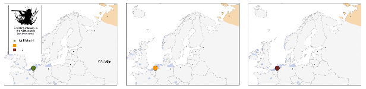
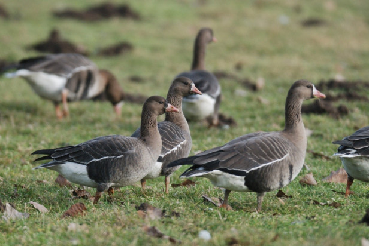

---
authors:
- Silke Bauer
categories: []
date: "2018-05-31T00:00:00Z"
image:
  caption: ""
  focal_point: ""
lastMod: "2018-05-31T00:00:00Z"
projects: []
subtitle: 
summary:  
tags:
- Optimal migration
- Stochastic dynamic programing
- R
title: "Mitigating conflicts between agriculture and migratory geese: is shooting a viable option or just passing on the problem?"
---

**Following the recent article, Shooting may aggravate rather than alleviate conflicts between migratory geese and agriculture, Silke Bauer explains why management plans for migratory goose populations need to be considered across a broader scale.**

A challenge with developing management plans for migratory populations is that these populations use several sites in their annual cycle. Therefore, local actions may not only affect how migratory animals behave and forage locally, but also when they move to another site, and how they behave and forage when there.

Unlike many other migratory species, most migratory goose populations have thrived in recent decades and massively increased their abundances. One reason behind these increases is probably their switch to agricultural food, which is abundantly available over long periods in the year. However, this use of agricultural resources frequently leads to conflicts with farmers. Control and management measures are therefore called for that have the shared objective of reducing these conflicts but still maintaining migratory populations.

Figure 1: Model predictions for the migration of White-fronted geese in the default case (left panel), with predation risk increased by a factor of 10 (middle panel) or 100 (right panel).

Geese are interacting with humans on various sites along the flyway. In the wintering area, they are left undisturbed or are increasingly shot for management purposes, while on most migratory sites geese are a quarry species. For example, in Russia geese are hunted mainly during spring migration.

We used a theoretical approach – a behaviour-based migration model – to assess the consequences of derogation shooting, hunting and scaring on the migration behaviour and demographic rates of geese, and how these accumulate in agricultural damage. We applied this model to the Baltic-North Sea population of white-fronted geese (Anser albifrons), which has increased from 10,000-50,000 in the 1950s to 1,200,000 around 2010, raising serious conflicts with agriculture, particularly in the Netherlands where the majority of these geese overwinter. We were particularly interested in whether such actions would alleviate conflicts with agriculture or pass on the problem to other sites. We ran scenarios with shooting/hunting being installed at single or multiple locations.

Figure 2: White-fronted geese. © Helmut Kruckenberg

We found that hunting, shooting and scaring can result in a suite of direct and indirect consequences on migration and foraging behaviour – from less intense foraging and later migratory departure, to avoiding sites. Most importantly, changing conditions on a particular site, be it through management or natural processes, not only alters the behaviour of migrants immediately and locally, but could also do so at a later time and at a distance. Furthermore, the specific consequences of shooting/hunting could be counter-intuitive, i.e. aggravate rather than alleviate agricultural damage, depending on where along the migration route changes had taken place and the mechanisms through which hunting/shooting was assumed to affect geese. This means that although local management actions can be effective locally, i.e. chase geese away or force them to migrate earlier, these might pass on the problem to sites further down the flyway.

While our modelling approach made several simplifying assumptions and can only be a first step in developing an adaptive management plan, our results do underline that management plans for migratory geese should be formulated and evaluated on a flyway level.

Read the full article, [Shooting may aggravate rather than alleviate conflicts between migratory geese and agriculture](https://besjournals.onlinelibrary.wiley.com/doi/10.1111/1365-2664.13152) in _Journal of Applied Ecology_.

[Link](https://appliedecologistsblog.com/2019/08/27/senior-editor-vacancy-apply-now/) to original blogpost.

[Link](/publication/bauer_et_al_2018-japplecol/) to article download.