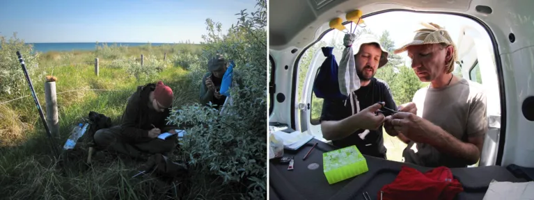

---
authors:
- admin
categories: []
date: "2021-07-02T00:00:00Z"
image:
  caption: ""
  focal_point: ""
lastMod: "2021-07-02T00:00:00Z"
projects: []
subtitle: Overcoming multiple setbacks, and teaming up with researchers from across Europe, finally brought insight into the previously mysterious travels of the common rosefinch.
summary:  
tags:
- Flyway
- Optimal migration
- Rosefinch
title: From Europe to India – A little investigated route of migratory birds
---

>*Editors’ Choice article*: Lisovski, S., Neumann, R., Albrecht, T., Munclinger, P., Ahola, M.P., Bauer, S., Cepak, J., Fransson, T., Jakobsson, S., Jaakkonen, T., Klvana, P., Kullberg, C., Laaksonen, T., Metzger, B., Piha, M., Shurulinkov, P., Stach, R., Ström, K., Velmala, W. and Briedis, M. (2021), The Indo-European flyway: Opportunities and constraints reflected by Common Rosefinches breeding across Europe. J Biogeogr. 48:1255–1266. https://doi.org/10.1111/jbi.14085 

To me, the common rosefinch is still a rather exotic bird species. In the last decades the bird with its iconic song that is often rendered as “pleased to meet you” ([check it out yourself](https://dibird.com/species/common-rosefinch/)), has expanded its huge breeding range westwards, and we have seen small populations emerging at new sites in Europe. During my undergraduate studies, my friend and co-author Roland Neumann was investigating a population at the Baltic Sea Coast. Since very little was known about their routes and their destinations, he was catching and banding individuals with the hope to get resightings from their wintering sites or from any location during their migratory journey. Unfortunately, the massive efforts didn’t pay off.

We were thus super excited that, in collaboration with the Swiss Ornithological Institute and co-funded by the German Ornithologists’ Society, we could deploy light-level geolocators on male rosefinches in 2011. These devices were still somewhat new in the sense that they have just gotten small enough to use on a 25g bird such as the common rosefinch. Those so called geolocators record light intensity that can be used after recapture and download of the data in the following year, to approximate their migratory journeys. At the same time, we were in close contact with colleagues from Czechia also working on this species and equally thrilled to deploy these loggers on some of the individuals from their Bohemian Mountain populations.

Fieldwork went exceptionally and we had almost an entire year to make plans for the next field season in which we needed to especially look out for returning birds with geolocators, recapture them and retrieve the data containing so much information and the answer to our main questions of the birds’ whereabouts outside the breeding season. Both in northern Germany and in Czechia, we recaptured around 30% of the individuals (a reasonable return rate and the sample size we hoped for) just to learn that none of the devices recorded any data! Obviously, quite a downer that required some time to digest and to even think about rosefinch migration again. Yet, we decided to give it another go and repeat the study in 2013. This time we succeeded and collected useful data from several individuals.

Roland Neumann and Benjamin Metzger banding and measuring common rosefinches in the dunes of the Baltic Sea in Germany (left). Tomas Albrecht and Jaroslav Cepak preparing their mobile lab after a successful catch of rosefinches in the mountains of Bulgaria (right). (Photo credit: Simeon Lisovski, Pavel Munclinger)

In the meantime, we learned that other research groups from across Europe were also collecting migration data from rosefinches. Colleagues from Finland deployed geolocators on males breeding as far north as Oulu (65°N), a Swedish research team collected tracks from males in southern Sweden, and besides the German and Czech data, Bulgarian colleagues were also successful in tracking rosefinches from their southern European breeding site (41°N). Since all of us were dealing with rather small sample sizes (3-10 tracks), we were all easily convinced and excited to pool the data allowing us to not only investigate population specific migration pattern in isolation but extend our objectives towards a flyway wide approach. Now, we saw the opportunity to identify general migration routes, bottlenecks as well as barriers on the so far understudied Indo-European flyway.

Inspired, by previous large-scale research on the effects of wind on bird migration (Kranstauber et al. 2015 Ecology Letters) we constructed simple theoretical migration models that optimized the routes with respect to wind and resource availability during migration. These theoretical tracks revealed interesting patterns with seasonally specific bottlenecks such as the areas south of the Caspian Sea during spring migration. The comparison between the theoretical tracks and the collected empirical tracks also showed that rosefinches seem to make use of the straighter winds from India to Europe during spring, probably allowing for fast and direct migration to the breeding sites, while engaging in larger detours during autumn following the routes that provide highest security in terms of resources.

To me, this study shows how valuable even small and local studies can be, if seen as puzzle pieces helping to reveal the larger picture. Obviously, this needs an open and collaborative network of researchers which I am very glad to have encountered during this project. I would like to thank all of my co-authors for sharing not only their data but for providing their insights into the study systems, for fruitful discussion, for pushing me hard to explain the modeling approach and forcing me to meet empirical fieldwork and theory halfway!

